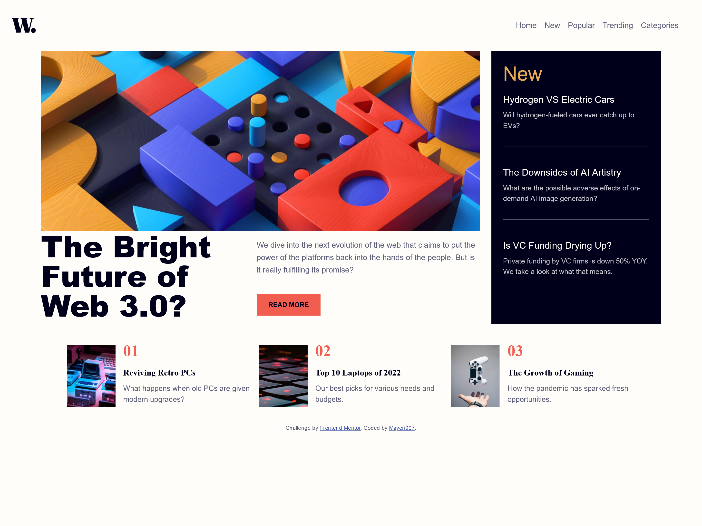
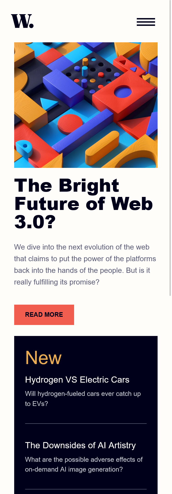

# Frontend Mentor - News Homepage Solution

This is a solution to the [News Homepage challenge on Frontend Mentor](https://www.frontendmentor.io/challenges/news-homepage-H6SWTa1MFl). Frontend Mentor challenges help you improve your coding skills by building realistic projects.

## Table of Contents

- [Overview](#overview)
  - [The Challenge](#the-challenge)
  - [Screenshot](#screenshot)
  - [Links](#links)
- [My Process](#my-process)
  - [Built With](#built-with)
  - [What I Learned](#what-i-learned)
  - [Continued Development](#continued-development)
  - [Useful Resources](#useful-resources)
- [Author](#author)

## Overview

### The Challenge

Users should be able to:

- View the optimal layout for the interface depending on their device's screen size
- See hover and focus states for all interactive elements on the page

### Screenshot




### Links

- Solution URL: [GitHub Repository](https://github.com/mayen007/news-homepage)
- Live Site URL: [Live Demo](https://mayen007.github.io/news-homepage/)

## My Process

### Built With

- Semantic HTML5 markup
- CSS custom properties
- Flexbox
- CSS Grid
- Mobile-first workflow
- [Bootstrap](https://getbootstrap.com/) - For responsive components

### What I Learned

This project helped reinforce the importance of creating responsive designs using both custom CSS and frameworks like Bootstrap. I implemented offcanvas navigation and utilized CSS Grid and Flexbox for layout management. Here is an example of a CSS snippet I am proud of:

```css
.hero__cta {
  display: inline-block;
  background-color: var(--primary-soft-red);
  color: var(--neutral-very-dark-blue);
  padding: 0.75rem 1.5rem;
  text-decoration: none;
  font-size: 0.85rem;
  text-transform: uppercase;
  cursor: pointer;
  transition: background-color 0.3s;
  font-weight: 700;
}

.hero__cta:hover {
  background-color: var(--neutral-very-dark-blue);
  color: var(--neutral-off-white);
}
```

### Continued Development

Moving forward, I aim to:

- Explore more advanced CSS Grid techniques
- Improve accessibility for offcanvas menus
- Incorporate JavaScript for additional interactivity

### Useful Resources

- [MDN Web Docs](https://developer.mozilla.org/en-US/) - Comprehensive documentation for HTML, CSS, and JavaScript.
- [Bootstrap Documentation](https://getbootstrap.com/docs/5.3/getting-started/introduction/) - Helpful for quickly setting up responsive components.

## Author

- Frontend Mentor - [@mayen007](https://www.frontendmentor.io/profile/mayen007)
- GitHub - [@mayen007](https://github.com/mayen007)

---

If you have any feedback or suggestions, feel free to reach out!
